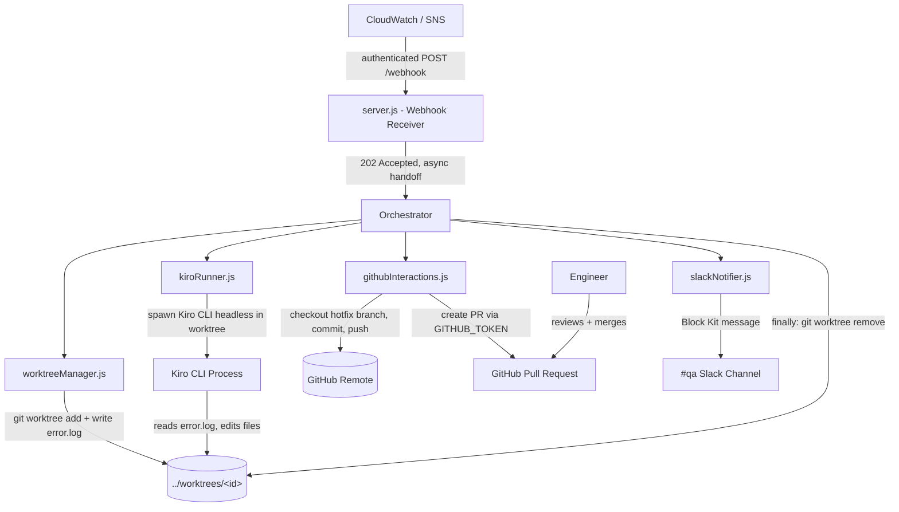
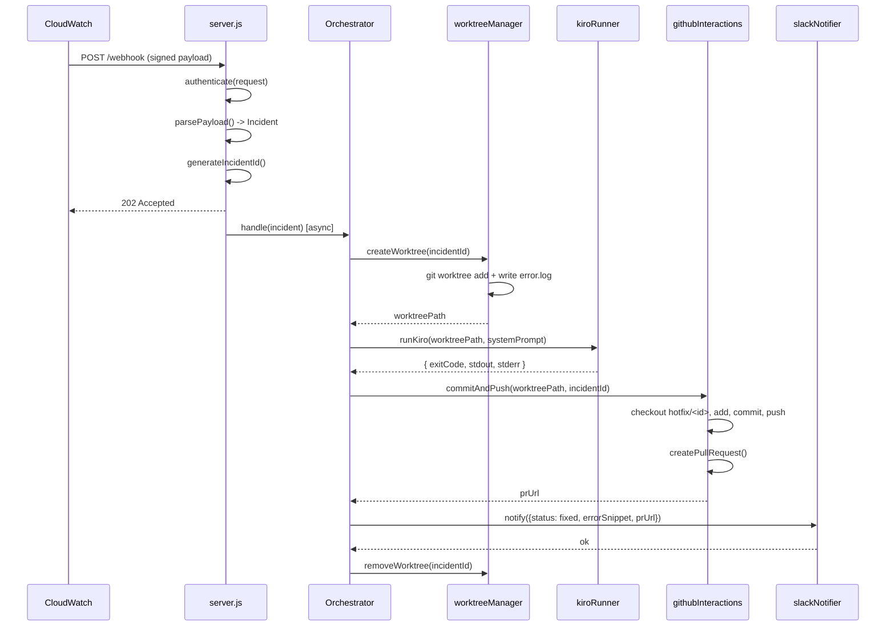
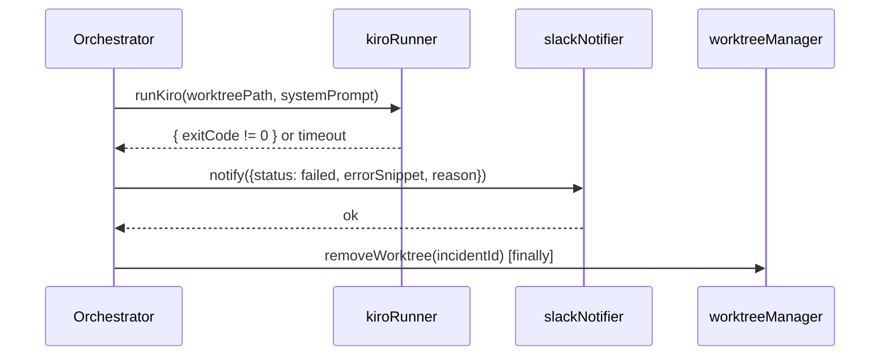

# Design Document: Auto-Triage Agent

## Overview

The Auto-Triage Agent is an autonomous, event-driven incident response system powered by Kiro. An always-on Agent Controller (a single, persistent Docker container simulating an ECS Fargate task) exposes an authenticated webhook that receives CloudWatch/SNS error notifications. For each notification it generates a unique incident ID, provisions an isolated `git worktree`, writes the raw error payload into that worktree as `error.log`, and spawns a sandboxed Kiro child process whose sole job is to read the error, locate the failing file(s), and write a code fix.

Once Kiro produces a fix, the Controller commits the change to a `hotfix/<incident-id>` branch, pushes the branch to the remote, opens a GitHub Pull Request, and posts a Slack alert to the `#qa` channel containing the incident status, a snippet of the error, and the PR link. The worktree is then removed. The defining constraint is human-in-the-loop safety: the agent never pushes to `main`/production and never merges — it stops at the PR, leaving review and merge to a human engineer.

This design covers the Agent Controller only. The system is scoped for a hackathon: a single target repository, simulated CloudWatch webhooks delivered as direct HTTP POSTs, and codebase-related runtime errors only (null pointers, bad JSON parsing) — not infrastructure failures such as out-of-memory crashes. Implementation language is Node.js with Express, axios, and dotenv.

## Architecture



The Controller is organized around a central **Orchestrator** that sequences the incident lifecycle and guarantees cleanup. Each subsystem is a focused module with a single responsibility, communicating through plain data objects. All side-effecting operations (shell commands, network calls, process spawning) are isolated behind module boundaries so the orchestration logic and parsing/validation logic remain pure and testable.

### Component Responsibility Map

| Module | Responsibility | Side Effects |
|--------|----------------|--------------|
| `server.js` | Receive, authenticate, parse webhooks; async handoff | HTTP I/O |
| `worktreeManager.js` | Create/remove isolated worktrees; write `error.log` | `git`, filesystem |
| `kiroRunner.js` | Invoke Kiro CLI headlessly (non-interactive); supervise child process | `child_process` |
| `githubInteractions.js` | Branch, commit, push, open PR | `git`, GitHub API |
| `slackNotifier.js` | Format and deliver Slack alerts | HTTP I/O |
| Orchestrator | Sequence lifecycle, enforce cleanup, error boundaries | none directly |

## Sequence Diagrams

### Happy Path: Error to PR



### Failure Path: Triage Could Not Produce a Fix



## Components and Interfaces

### Component 1: Webhook Receiver (`server.js`)

**Purpose**: Expose the network endpoint, authenticate inbound requests, parse CloudWatch payloads, generate incident IDs, and hand off to the orchestrator asynchronously while returning `202 Accepted` immediately.

**Interface**:
```javascript
// Express route handlers
function handleWebhook(req, res)   // POST /webhook
function handleHealth(req, res)    // GET /health

// Pure helpers (unit/property testable)
function authenticate(headers, rawBody, secret) // -> boolean
function parsePayload(rawBody)                   // -> Incident
function generateIncidentId(now)                 // -> string "inc-<...>"
```

**Responsibilities**:
- Authenticate every request to `/webhook` via a shared secret or SNS signature before any processing.
- Parse the multiline `[ERROR]` + stack trace payload into a normalized `Incident` object.
- Generate a unique, injection-safe incident ID.
- Return `202 Accepted` and run orchestration asynchronously (do not block the response).
- Provide a `GET /health` liveness endpoint.

### Component 2: Worktree Manager (`worktreeManager.js`)

**Purpose**: Provision and tear down isolated `git worktree` directories per incident and write the error payload into them.

**Interface**:
```javascript
async function createWorktree(incidentId, errorLog) // -> worktreePath
async function removeWorktree(incidentId)           // -> void
function sanitizeIncidentId(incidentId)             // -> string | throws
function worktreePathFor(incidentId)                // -> string
```

**Responsibilities**:
- Sanitize incident IDs before they touch any shell command or filesystem path.
- Run `git worktree add ../worktrees/<id> main` via `child_process` with argument arrays (no shell string interpolation).
- Write the `error.log` payload into the new worktree directory.
- Remove the worktree on completion (success or failure), tolerating partial/failed states.

### Component 3: Kiro Runner (`kiroRunner.js`)

**Purpose**: Invoke the **Kiro CLI in headless (non-interactive) mode** as a child process scoped to a specific worktree, supply the system prompt, capture output, and enforce a timeout. The Controller runs as a headless Docker container with no IDE, so triage must be driven entirely through Kiro's command-line interface — never the IDE.

**Interface**:
```javascript
async function runKiro(worktreePath, systemPrompt, options)
// -> { exitCode, stdout, stderr, timedOut }

function loadSystemPrompt(path)        // -> string
function buildKiroArgs(systemPrompt)   // -> string[] (CLI flags/args, no shell string)
```

**Responsibilities**:
- Load the system prompt from `system_prompts/incident_responder.txt`.
- Invoke the Kiro CLI binary headlessly (non-interactive, one-shot run) via `child_process` using an argument array — never launch or attach to the Kiro IDE, and never use interactive flags that require a TTY/human input.
- Set the child process working directory to the worktree (so it cannot affect other incidents) and authenticate via `KIRO_API_KEY` from the environment.
- Capture stdout/stderr and the exit code; enforce a configurable timeout that kills the process.
- Report a structured result the orchestrator can branch on.

### Component 4: GitHub Interactions (`githubInteractions.js`)

**Purpose**: Perform Git branch/commit/push operations and open a Pull Request, never targeting `main`.

**Interface**:
```javascript
async function commitAndPush(worktreePath, incidentId, message) // -> branchName
async function createPullRequest(incidentId, prMeta)            // -> prUrl
function buildBranchName(incidentId)                            // -> "hotfix/<id>"
function buildPrBody(incident, affectedFiles)                  // -> string
```

**Responsibilities**:
- Create branch `hotfix/<incident-id>`; `git add`, `git commit`, `git push -u` to that branch only.
- Reject any operation whose target branch resolves to `main`/production.
- Open a PR via the GitHub API using `GITHUB_TOKEN`; title < 70 chars, body with error summary, affected file(s), and what was tested.
- Return the PR URL; surface auth/push/PR failures as structured errors.

### Component 5: Slack Notifier (`slackNotifier.js`)

**Purpose**: Format and deliver Slack Block Kit alerts to the `#qa` channel for both success and failure outcomes.

**Interface**:
```javascript
async function notify(notification) // -> { delivered: boolean }
function buildBlocks(notification)  // -> object (Block Kit payload)
```

**Responsibilities**:
- Build a Block Kit message containing status, error snippet, and (on success) the PR link.
- Post to `SLACK_WEBHOOK_URL`.
- Send a distinct failure variant when triage produced no fix.
- Handle webhook delivery errors without crashing the orchestrator.

### Component 6: Orchestrator (within `server.js` or a dedicated module)

**Purpose**: Sequence the full incident lifecycle and guarantee worktree cleanup.

**Interface**:
```javascript
async function handleIncident(incident) // -> IncidentResult
```

**Responsibilities**:
- Drive the flow: create worktree → run Kiro → commit/push/PR → notify → cleanup.
- Wrap the entire body so `removeWorktree` always runs (finally-style), on success or failure.
- Isolate incidents so one failure never blocks or corrupts another.

## Data Models

### Model 1: Incident

```javascript
/**
 * Normalized representation of a CloudWatch error event.
 */
const Incident = {
  id: "string",            // e.g. "inc-1718031200-a1b2"
  errorMessage: "string",  // first [ERROR] line
  stackTrace: "string",    // full multiline trace
  rawPayload: "string",    // original payload, written verbatim to error.log
  receivedAt: "number"     // epoch millis
};
```

**Validation Rules**:
- `id` matches `^inc-[A-Za-z0-9-]+$` (no path separators, spaces, or shell metacharacters).
- `errorMessage` is a non-empty string.
- `rawPayload` is preserved exactly as received (used as `error.log` contents).

### Model 2: KiroResult

```javascript
const KiroResult = {
  exitCode: "number",   // 0 = success
  stdout: "string",
  stderr: "string",
  timedOut: "boolean"
};
```

**Validation Rules**:
- A fix is considered successful only when `exitCode === 0 && timedOut === false`.

### Model 3: Notification

```javascript
const Notification = {
  status: "string",       // "fixed" | "failed"
  incidentId: "string",
  errorSnippet: "string", // truncated, secret-free excerpt
  prUrl: "string|null",   // present when status === "fixed"
  reason: "string|null"   // present when status === "failed"
};
```

**Validation Rules**:
- `errorSnippet` is truncated to a fixed maximum length and must never contain secret values.
- When `status === "fixed"`, `prUrl` is a non-empty string.

### Model 4: Config

```javascript
const Config = {
  githubToken: "string",     // GITHUB_TOKEN
  slackWebhookUrl: "string", // SLACK_WEBHOOK_URL
  kiroApiKey: "string",      // KIRO_API_KEY
  repoUrl: "string",         // REPO_URL
  webhookSecret: "string",   // shared secret for endpoint auth
  kiroTimeoutMs: "number"
};
```

**Validation Rules**:
- All required variables must be present at startup; the Controller fails fast if any is missing.
- Secret values are never written to logs.

## Algorithmic Pseudocode

### Incident Orchestration

```pascal
ALGORITHM handleIncident(incident)
INPUT: incident of type Incident
OUTPUT: result of type IncidentResult

BEGIN
  ASSERT isValidIncidentId(incident.id) = true

  worktreePath ← NULL
  TRY
    // Step 1: Isolated environment
    worktreePath ← createWorktree(incident.id, incident.rawPayload)

    // Step 2: Triage with Kiro
    kiroResult ← runKiro(worktreePath, loadSystemPrompt())

    IF kiroResult.exitCode = 0 AND kiroResult.timedOut = false THEN
      // Step 3: Git operations (new branch ONLY)
      branch ← commitAndPush(worktreePath, incident.id, commitMessage(incident))
      ASSERT branch ≠ "main" AND branch ≠ "production"

      // Step 4: Pull Request
      prUrl ← createPullRequest(incident.id, prMeta(incident))

      // Step 5: Notify success
      notify({status: "fixed", incidentId: incident.id,
              errorSnippet: snippet(incident), prUrl: prUrl})
      result ← Success(prUrl)
    ELSE
      // Triage failed: notify, do not push anything
      notify({status: "failed", incidentId: incident.id,
              errorSnippet: snippet(incident), reason: failureReason(kiroResult)})
      result ← Failure(failureReason(kiroResult))
    END IF
  CATCH error
    notify({status: "failed", incidentId: incident.id,
            errorSnippet: snippet(incident), reason: error.message})
    result ← Failure(error.message)
  FINALLY
    // Step 6: Guaranteed cleanup
    IF worktreePath ≠ NULL THEN
      removeWorktree(incident.id)
    END IF
  END TRY

  RETURN result
END
```

**Preconditions:**
- `incident` is a well-formed, validated `Incident` with a sanitized `id`.
- All required configuration is present (validated at startup).

**Postconditions:**
- A worktree created during handling is always removed before return (success or failure).
- A PR is created only when Kiro exits successfully; otherwise no branch/PR is produced.
- A Slack notification is sent in every terminal outcome (fixed or failed).

**Loop Invariants:** N/A (no loops; linear pipeline with finally-cleanup).

### Incident ID Sanitization

```pascal
ALGORITHM sanitizeIncidentId(id)
INPUT: id of type String
OUTPUT: safeId of type String (or raises error)

BEGIN
  IF id = NULL OR id = "" THEN
    RAISE Error("incident id required")
  END IF

  // Reject anything outside the safe alphabet
  IF NOT matches(id, "^inc-[A-Za-z0-9-]+$") THEN
    RAISE Error("invalid incident id")
  END IF

  RETURN id
END
```

**Preconditions:**
- `id` is the candidate identifier (possibly attacker-controlled if derived from payload).

**Postconditions:**
- Returns `id` unchanged only if it contains no path separators, whitespace, or shell metacharacters.
- Raises an error for any unsafe input, preventing path/command injection downstream.

**Loop Invariants:** N/A.

### Webhook Authentication

```pascal
ALGORITHM authenticate(headers, rawBody, secret)
INPUT: headers (map), rawBody (string), secret (string)
OUTPUT: isAuthentic of type boolean

BEGIN
  provided ← headers["x-signature"]
  IF provided = NULL THEN
    RETURN false
  END IF

  expected ← hmac(secret, rawBody)

  // constant-time comparison to avoid timing leaks
  RETURN constantTimeEquals(provided, expected)
END
```

**Preconditions:**
- `secret` is loaded from configuration and non-empty.

**Postconditions:**
- Returns `true` only when the provided signature matches the HMAC of the raw body.
- Comparison does not short-circuit on first mismatch (timing-safe).

**Loop Invariants:** N/A.

## Key Functions with Formal Specifications

### parsePayload()

```javascript
function parsePayload(rawBody) // -> Incident
```

**Preconditions:**
- `rawBody` is a string containing a CloudWatch-style payload with at least one `[ERROR]` line.

**Postconditions:**
- Returns an `Incident` whose `rawPayload` equals `rawBody` exactly.
- `errorMessage` contains the first `[ERROR]` line; `stackTrace` contains the remaining lines.
- No mutation of the input.

### generateIncidentId()

```javascript
function generateIncidentId(now) // -> string
```

**Preconditions:**
- `now` is a valid timestamp source.

**Postconditions:**
- Returns a string matching `^inc-[A-Za-z0-9-]+$`.
- Two calls with distinct entropy/time produce distinct IDs (uniqueness).

### commitAndPush()

```javascript
async function commitAndPush(worktreePath, incidentId, message) // -> branchName
```

**Preconditions:**
- `worktreePath` is an existing worktree containing committed-ready changes.
- `incidentId` is sanitized.

**Postconditions:**
- The pushed branch name equals `hotfix/<incidentId>` and is never `main`/`production`.
- On any failure, a structured error is thrown and no `main` history is altered.

## Example Usage

```javascript
// server.js — webhook entry point
app.post("/webhook", async (req, res) => {
  if (!authenticate(req.headers, req.rawBody, config.webhookSecret)) {
    return res.status(401).json({ error: "unauthorized" });
  }

  const incident = {
    ...parsePayload(req.rawBody),
    id: generateIncidentId(Date.now()),
    receivedAt: Date.now(),
  };

  // Respond immediately; process out of band
  res.status(202).json({ accepted: true, incidentId: incident.id });

  handleIncident(incident).catch((err) =>
    logger.error("incident handling failed", { id: incident.id, err: err.message })
  );
});

// Orchestrator usage
const result = await handleIncident(incident);
// worktree is always cleaned up by the time this resolves
```

```bash
# tests/simulate_webhook.sh — fire a mock CloudWatch error at localhost
curl -X POST http://localhost:3000/webhook \
  -H "Content-Type: application/json" \
  -H "x-signature: $(compute_hmac "$PAYLOAD")" \
  --data "$PAYLOAD"
```

## Correctness Properties

*A property is a characteristic or behavior that should hold true across all valid executions of a system — essentially, a formal statement about what the system should do. Properties serve as the bridge between human-readable specifications and machine-verifiable correctness guarantees.*

### Property 1: Incident ID safety

For any string input, `sanitizeIncidentId` either returns an output matching `^inc-[A-Za-z0-9-]+$` or raises an error — it never returns a value containing path separators, whitespace, or shell metacharacters.

**Validates: Requirements 3.3, 3.4, 4.3**

### Property 2: Incident ID uniqueness

For any sequence of `generateIncidentId` calls with distinct time/entropy inputs, all generated IDs are distinct.

**Validates: Requirements 3.1, 3.2**

### Property 3: Payload parsing round-trip

For any well-formed CloudWatch payload, `parsePayload(rawBody).rawPayload` equals `rawBody` exactly (the original payload is preserved verbatim for `error.log`).

**Validates: Requirements 2.1, 2.3, 4.2**

### Property 4: Authentication soundness

For any request, `authenticate` returns `true` if and only if the provided signature equals the HMAC of the raw body under the configured secret; any tampered body or missing/incorrect signature returns `false`.

**Validates: Requirements 1.3, 1.4, 1.5**

### Property 5: Cleanup guarantee

For any incident handling execution — whether Kiro succeeds, fails, times out, or throws — if a worktree was created, it is removed before `handleIncident` returns.

**Validates: Requirements 9.1, 9.2**

### Property 6: No push to protected branches

For any incident, the branch produced by `commitAndPush` equals `hotfix/<incidentId>` and is never `main` or `production`; no PR or push targets a protected branch.

**Validates: Requirements 6.1, 6.2, 6.3**

### Property 7: PR only on successful triage

For any incident, a Pull Request is created if and only if the Kiro process exited successfully (exit code 0 and not timed out).

**Validates: Requirements 5.5, 7.1, 7.2**

### Property 8: Notification completeness

For any incident handling execution that reaches a terminal state, exactly one Slack notification is dispatched, and its `status` reflects the outcome (`fixed` with a non-null `prUrl`, or `failed` with a reason).

**Validates: Requirements 8.1, 8.2, 8.3**

### Property 9: Snippet secret-safety

For any incident, the `errorSnippet` placed in a notification is bounded in length and contains no configured secret values.

**Validates: Requirements 11.2, 11.3**

## Error Handling

### Error Scenario 1: Unauthenticated webhook request

**Condition**: Request to `/webhook` has a missing or invalid signature.
**Response**: Return `401 Unauthorized`; do not parse, generate an incident, or start orchestration.
**Recovery**: Caller may retry with a valid signature; no state is created.

### Error Scenario 2: Malformed payload

**Condition**: `parsePayload` cannot find an `[ERROR]` line or receives non-string/empty input.
**Response**: Return `400 Bad Request`; log a structured warning (no secrets).
**Recovery**: No worktree is created; the request is rejected cleanly.

### Error Scenario 3: Worktree creation fails

**Condition**: `git worktree add` fails (e.g., disk, locked ref, name collision).
**Response**: Throw a structured error; orchestrator sends a `failed` notification and runs cleanup.
**Recovery**: Cleanup attempts `git worktree remove`/prune; the incident is reported as failed.

### Error Scenario 4: Kiro process fails or times out

**Condition**: Kiro exits non-zero or exceeds `kiroTimeoutMs`.
**Response**: Kill the process if timed out; skip git/PR; send a `failed` Slack notification with reason.
**Recovery**: Worktree removed in the finally block; no branch or PR produced.

### Error Scenario 5: Push or PR creation fails

**Condition**: `git push` or GitHub PR API call fails (auth, network, conflict).
**Response**: Throw a structured error; send a `failed` notification including the failure reason.
**Recovery**: Worktree removed; partial branch state does not affect `main`.

### Error Scenario 6: Slack delivery fails

**Condition**: `SLACK_WEBHOOK_URL` returns a non-2xx response.
**Response**: Log the delivery failure; do not crash the orchestrator or block cleanup.
**Recovery**: The incident still completes and the worktree is still removed.

### Error Scenario 7: Missing configuration at startup

**Condition**: A required environment variable is absent.
**Response**: Fail fast at startup with a clear message naming the missing variable (by key, not value).
**Recovery**: Operator sets the variable and restarts the Controller.

## Testing Strategy

### Unit Testing Approach

Unit tests cover specific examples, edge cases, and error conditions: malformed payloads, missing signatures, empty incident IDs, missing env vars, and Slack/Git failure branches. Side-effecting modules (`worktreeManager`, `kiroRunner`, `githubInteractions`, `slackNotifier`) are tested with mocked `child_process` and mocked HTTP clients so logic is verified without real Git/network operations.

### Property-Based Testing Approach

Property tests validate the universal properties above across many generated inputs — especially incident ID sanitization (fuzzed with injection payloads), payload round-trip preservation, authentication soundness, and the cleanup guarantee (simulated success/failure/timeout/throw paths).

**Property Test Library**: fast-check (JavaScript).

### Integration Testing Approach

A single end-to-end integration test fires `tests/simulate_webhook.sh` (or its programmatic equivalent) at a running Controller with Kiro, Git, and Slack mocked, asserting: worktree created → orchestration runs → worktree removed. This verifies wiring, not external service behavior.

## Security Considerations

- **Authenticated endpoint**: `/webhook` is network-exposed and rejects unauthenticated requests via shared-secret HMAC (or SNS signature) using timing-safe comparison. Creating an unauthenticated trigger is explicitly disallowed.
- **Injection prevention**: All incident IDs are sanitized against a strict allowlist before touching shell commands or filesystem paths; `child_process` invocations use argument arrays, never interpolated shell strings.
- **Human-in-the-loop**: The agent stops at the PR. It never pushes to `main`/production and never auto-merges.
- **Secret hygiene**: Secrets come from environment variables, are validated at startup, are never logged, and are stripped/excluded from error snippets sent to Slack.
- **Isolation**: Each incident operates in its own worktree; the Kiro process is scoped to that directory and cannot affect other incidents or the main checkout.

## Performance Considerations

- Webhook handler returns `202 Accepted` immediately and processes incidents out of band so the endpoint stays responsive under bursts.
- `git worktree` avoids per-incident full clones, giving near-zero-time isolated environments.
- The Kiro child process runs under a configurable timeout to bound worst-case incident duration.

## Dependencies

- **Runtime**: Node.js
- **Libraries**: `express` (webhook server), `axios` (Slack/GitHub HTTP), `dotenv` (config loading)
- **Dev/Test**: a test runner (e.g., Jest or Vitest), `fast-check` (property-based testing), ESLint + Prettier
- **External tools**: `git` (worktree + branch operations), Kiro CLI/agent, GitHub API (PR creation)
- **Environment variables**: `GITHUB_TOKEN`, `SLACK_WEBHOOK_URL`, `KIRO_API_KEY`, `REPO_URL`, plus a webhook auth secret
