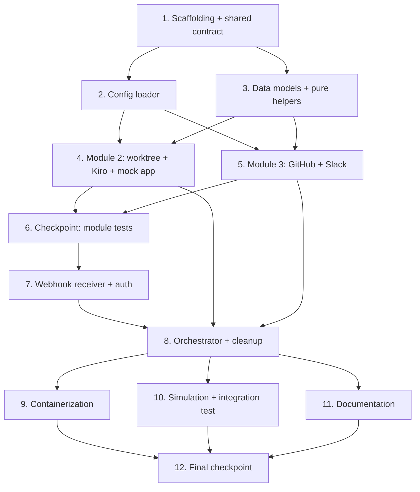

# Implementation Plan: Auto-Triage Agent

## Overview

This plan converts the approved design into a series of incremental coding steps that build a
complete, functional Node.js Agent Controller. The project is created under `auto-triage-agent/`
at the workspace root, following the `structure.md` blueprint. Work is sequenced so foundational
pieces (scaffolding, config, data models, shared contract) land first, then the focused side-effecting
modules, then orchestration wiring, then containerization, and finally tests and documentation.

Tasks are grouped by the three TEAM_PLAN modules (Person A / B / C). After the shared foundation is
in place, the three module tracks (Tasks 4, 5, 6) are largely independent and **can be worked in
parallel** — each is marked `[parallel]`. Implementation language is **Node.js** (Express, axios,
dotenv), as fixed by the design; the test runner is **Jest** and property tests use **fast-check**.

Tasks marked with `*` are optional test sub-tasks and can be skipped for a faster MVP. Each property
test references a numbered Correctness Property from the design and the requirement clause it validates.

## Task Dependency Graph



Tasks 4 and 5 are independent of each other and can be executed in parallel once the foundation
(Tasks 1–3) is complete.

```json
{
  "waves": [
    { "wave": 1, "tasks": ["1"] },
    { "wave": 2, "tasks": ["2", "3"] },
    { "wave": 3, "tasks": ["4", "5"] },
    { "wave": 4, "tasks": ["6"] },
    { "wave": 5, "tasks": ["7"] },
    { "wave": 6, "tasks": ["8"] },
    { "wave": 7, "tasks": ["9", "10", "11"] },
    { "wave": 8, "tasks": ["12"] }
  ]
}
```

## Tasks

- [x] 1. Project scaffolding and shared contract (Module 1 / Person A — foundation)
  - Create the `auto-triage-agent/` directory tree per `structure.md`: `src/`, `system_prompts/`, `tests/`, `mock-app/`.
  - Add `package.json` with runtime deps `express`, `axios`, `dotenv` and dev deps `jest`, `fast-check`, `eslint`, `prettier`; define npm scripts `start`, `dev`, `test`, `lint`.
  - Add `.gitignore` excluding `node_modules`, `.env`, `worktrees/`, `*.log`.
  - Add `.env.example` documenting `GITHUB_TOKEN`, `SLACK_WEBHOOK_URL`, `KIRO_API_KEY`, `REPO_URL`, `WEBHOOK_SECRET`, `KIRO_TIMEOUT_MS`, `PORT`.
  - Create `src/contracts.md` capturing the shared module interfaces and the incident object shape so all three module tracks can mock against them.
  - _Requirements: 12.1, 12.2_

- [x] 2. Configuration loader with fail-fast validation (Module 1 / Person A)
  - [x] 2.1 Implement `src/config.js` Config_Loader
    - Load env vars via `dotenv`; build the `Config` data model (`githubToken`, `slackWebhookUrl`, `kiroApiKey`, `repoUrl`, `webhookSecret`, `kiroTimeoutMs`).
    - Validate that every required variable is present at startup; on a missing variable, fail fast (exit non-zero) with a message naming the variable by key, never logging secret values.
    - Provide a list of configured secret values for downstream secret-scrubbing use.
    - _Requirements: 10.1, 10.2, 11.1_
  - [x]* 2.2 Write unit tests for the config loader
    - Test that all-present config loads successfully and that each missing variable triggers fail-fast naming that key with no secret value in the message.
    - _Requirements: 10.1, 10.2, 11.1_

- [x] 3. Core data models and pure helpers (Module 1 / Person A — foundation)
  - [x] 3.1 Implement incident ID generation and payload parsing in `src/incident.js`
    - `generateIncidentId(now)` returns a string matching `^inc-[A-Za-z0-9-]+$`, combining timestamp and entropy for uniqueness.
    - `parsePayload(rawBody)` returns an `Incident` with `errorMessage` (first `[ERROR]` line), `stackTrace` (remaining lines), and `rawPayload` exactly equal to the input; throws/signals invalid for empty, non-string, or `[ERROR]`-free input.
    - Define the `Incident`, `KiroResult`, and `Notification` model shapes/validators.
    - _Requirements: 2.1, 2.2, 2.3, 2.4, 3.1, 3.2_
  - [x]* 3.2 Write property test for incident ID uniqueness
    - **Property 2: Incident ID uniqueness** — for any sequence of `generateIncidentId` calls with distinct time/entropy inputs, all generated IDs are distinct.
    - **Validates: Requirements 3.1, 3.2**
  - [x]* 3.3 Write property test for payload parsing round-trip
    - **Property 3: Payload parsing round-trip** — for any well-formed payload, `parsePayload(rawBody).rawPayload` equals `rawBody` exactly.
    - **Validates: Requirements 2.1, 2.3, 4.2**
  - [x]* 3.4 Write unit tests for payload parsing edge cases
    - Cover empty, non-string, and no-`[ERROR]`-line inputs (400-class rejection) and correct splitting of message vs. stack trace.
    - _Requirements: 2.2, 2.4_

- [x] 4. Module 2 / Person B — Isolated workspace and AI triage [parallel]
  - [x] 4.1 Implement incident ID sanitization in `src/worktreeManager.js`
    - `sanitizeIncidentId(id)` returns the id unchanged only when it matches `^inc-[A-Za-z0-9-]+$`; otherwise raises an error, never returning path separators, whitespace, or shell metacharacters.
    - _Requirements: 3.3, 3.4, 4.3_
  - [x]* 4.2 Write property test for incident ID safety
    - **Property 1: Incident ID safety** — for any string input (including injection payloads), `sanitizeIncidentId` either returns a value matching `^inc-[A-Za-z0-9-]+$` or raises.
    - **Validates: Requirements 3.3, 3.4, 4.3**
  - [x] 4.3 Implement worktree create/remove in `src/worktreeManager.js`
    - `worktreePathFor(incidentId)` derives a distinct path under `../worktrees/<id>` so concurrent incidents never collide.
    - `createWorktree(incidentId, errorLog)` sanitizes the id, runs `git worktree add` via `child_process` with an argument array (no shell string), then writes `errorLog` verbatim into the worktree as `error.log`; raises a structured error on failure.
    - `removeWorktree(incidentId)` runs `git worktree remove`/prune, tolerating partial or failed states.
    - _Requirements: 4.1, 4.2, 4.3, 4.4, 4.5, 9.2_
  - [x]* 4.4 Write unit tests for worktreeManager with mocked child_process
    - Assert `git` is invoked with argument arrays (not interpolated strings), `error.log` is written verbatim, distinct ids yield distinct paths, and removal tolerates failures.
    - _Requirements: 4.1, 4.2, 4.4, 4.5, 9.2_
  - [x] 4.5 Implement Kiro runner in `src/kiroRunner.js`
    - `loadSystemPrompt(path)` reads `system_prompts/incident_responder.txt`.
    - `buildKiroArgs(systemPrompt)` builds a CLI argument array for a **headless, non-interactive** Kiro run (no IDE, no TTY flags).
    - `runKiro(worktreePath, systemPrompt, options)` spawns the Kiro CLI via `child_process` with cwd set to the worktree, authenticates via `KIRO_API_KEY`, captures stdout/stderr/exitCode, enforces a configurable timeout that kills the process, and returns a structured `KiroResult` with `timedOut`.
    - _Requirements: 5.1, 5.2, 5.3, 5.4, 5.5_
  - [x]* 4.6 Write unit tests for kiroRunner with mocked child_process
    - Assert headless arg array (never IDE/interactive), cwd is the worktree, timeout kills and sets `timedOut: true`, and stdout/stderr/exitCode are captured into `KiroResult`.
    - _Requirements: 5.1, 5.3, 5.4_
  - [x] 4.7 Author `system_prompts/incident_responder.txt`
    - Define Kiro's role inside the worktree: read `error.log`, locate the failing file, edit only affected file(s); constrain to codebase errors (null pointer, bad JSON parse), not infra/OOM; explicit guardrail to never push to `main`/production.
    - _Requirements: 5.2, 6.2, 12.3_
  - [x] 4.8 Build the mock production app under `mock-app/`
    - Minimal API that intentionally throws a null-pointer error and a bad-JSON-parse error; log exceptions starting with `[ERROR]` plus full stack trace in the exact format the parser expects; document the CloudWatch `awslogs-multiline-pattern`.
    - _Requirements: 12.1, 12.3_

- [x] 5. Module 3 / Person C — Resolution delivery and notifications [parallel]
  - [x] 5.1 Implement branch naming and PR body builders in `src/githubInteractions.js`
    - `buildBranchName(incidentId)` returns `hotfix/<incident-id>`.
    - `buildPrBody(incident, affectedFiles)` returns a body containing the error summary, affected file(s), and what was tested; ensure a PR title helper stays under 70 characters.
    - _Requirements: 6.1, 7.3_
  - [x]* 5.2 Write property test for no push to protected branches
    - **Property 6: No push to protected branches** — for any incident, `buildBranchName`/`commitAndPush` produces `hotfix/<incidentId>` and never `main` or `production`.
    - **Validates: Requirements 6.1, 6.2, 6.3**
  - [x] 5.3 Implement commit/push and PR creation in `src/githubInteractions.js`
    - `commitAndPush(worktreePath, incidentId, message)` creates the hotfix branch, `git add`/`commit`/`push -u` to that branch only via argument arrays; reject and raise if the target resolves to a Protected_Branch; never alter `main` history on failure.
    - `createPullRequest(incidentId, prMeta)` opens a PR via the GitHub API using `GITHUB_TOKEN`, returns the PR URL, and raises a structured error on failure; the controller never merges.
    - _Requirements: 6.1, 6.2, 6.3, 6.4, 6.5, 7.1, 7.3, 7.4, 7.5_
  - [x]* 5.4 Write unit tests for githubInteractions with mocked git and HTTP
    - Cover protected-branch rejection, hotfix-only push, PR body/title content, returned PR URL, and graceful structured errors on push/PR failure.
    - _Requirements: 6.3, 6.5, 7.3, 7.4, 7.5_
  - [x] 5.5 Implement Slack notifier in `src/slackNotifier.js`
    - `buildBlocks(notification)` builds a Block Kit payload for `#qa` with status, error snippet, and (on success) PR link; provide a distinct failure variant with reason.
    - `notify(notification)` posts to `SLACK_WEBHOOK_URL` via axios; on non-2xx, log the delivery failure and return without throwing (never crash the orchestrator or block cleanup).
    - Build the `errorSnippet` truncated to a fixed max length and scrub all configured secret values.
    - _Requirements: 8.1, 8.2, 8.3, 8.4, 11.2, 11.3_
  - [x]* 5.6 Write property test for snippet secret-safety
    - **Property 9: Snippet secret-safety** — for any incident, the `errorSnippet` is bounded in length and contains no configured secret values.
    - **Validates: Requirements 11.2, 11.3**
  - [x]* 5.7 Write unit tests for slackNotifier with mocked webhook
    - Cover success and failure block variants and that a non-2xx response is logged without throwing.
    - _Requirements: 8.2, 8.3, 8.4_

- [x] 6. Checkpoint — Ensure all module tests pass
  - Ensure all tests pass, ask the user if questions arise.

- [x] 7. Webhook receiver and authentication (Module 1 / Person A)
  - [x] 7.1 Implement authentication in `src/server.js`
    - `authenticate(headers, rawBody, secret)` computes the HMAC of the raw body with the webhook secret and compares it to the provided signature using a constant-time comparison that does not short-circuit; missing/invalid signature returns false.
    - _Requirements: 1.3, 1.4, 1.5_
  - [x]* 7.2 Write property test for authentication soundness
    - **Property 4: Authentication soundness** — `authenticate` returns true iff the provided signature equals the HMAC of the raw body under the configured secret; tampered body or missing/incorrect signature returns false.
    - **Validates: Requirements 1.3, 1.4, 1.5**
  - [x] 7.3 Implement Express routes and async handoff in `src/server.js`
    - Configure raw-body capture for HMAC; `POST /webhook` authenticates (401 on failure, no parsing/orchestration), parses the payload (400 on malformed), generates the incident id, responds `202 Accepted`, and hands off to the orchestrator asynchronously; `GET /health` returns 200.
    - _Requirements: 1.1, 1.2, 1.5, 1.6, 2.4_
  - [x]* 7.4 Write unit tests for server routes
    - Cover 401 unauthenticated, 400 malformed payload, 202 accepted with async handoff, and 200 health.
    - _Requirements: 1.1, 1.2, 1.5, 1.6, 2.4_

- [x] 8. Orchestrator with guaranteed cleanup (Module 1 / Person A — integration wiring)
  - [x] 8.1 Implement `handleIncident` in `src/orchestrator.js`
    - Sequence the lifecycle: `createWorktree` → `runKiro` → on success `commitAndPush` + `createPullRequest` + `notify(fixed)`; on Kiro failure/timeout `notify(failed)` with no push/PR; wrap the body so `removeWorktree` always runs in a finally block.
    - Treat triage as successful only when `exitCode === 0 && timedOut === false`; isolate each incident so one failure cannot block or corrupt another.
    - Build the secret-free, length-bounded `errorSnippet` for notifications.
    - _Requirements: 5.5, 7.1, 7.2, 8.1, 9.1, 9.3, 11.2, 11.3_
  - [x]* 8.2 Write property test for cleanup guarantee
    - **Property 5: Cleanup guarantee** — for any execution (Kiro success, failure, timeout, or throw), if a worktree was created it is removed before `handleIncident` returns.
    - **Validates: Requirements 9.1, 9.2**
  - [x]* 8.3 Write property test for PR only on successful triage
    - **Property 7: PR only on successful triage** — a Pull Request is created iff the Kiro process exited successfully (exit code 0 and not timed out).
    - **Validates: Requirements 5.5, 7.1, 7.2**
  - [x]* 8.4 Write property test for notification completeness
    - **Property 8: Notification completeness** — every terminal execution dispatches exactly one Slack notification whose status reflects the outcome (`fixed` with non-null `prUrl`, or `failed` with a reason).
    - **Validates: Requirements 8.1, 8.2, 8.3**
  - [x] 8.5 Wire server to orchestrator and config startup
    - Boot `src/config.js` validation at process start, then start the Express server from `server.js`, invoking `handleIncident` from the webhook handler so there is no orphaned code.
    - _Requirements: 1.6, 9.3, 10.1_

- [x] 9. Containerization (Module 1 / Person A)
  - Create `auto-triage-agent/Dockerfile` on a base image with Git, Node, and the Kiro CLI installed; install deps, copy source, run as an always-on worker, expose the webhook port, and pass secrets via env (never baked into the image).
  - _Requirements: 12.1, 11.1_

- [x] 10. Local simulation and integration test (Module 1 / Person A)
  - [x] 10.1 Create `tests/simulate_webhook.sh`
    - POST a mock CloudWatch `[ERROR]` + stack trace payload to localhost with a valid HMAC signature header, matching the mock app's error format and the parser.
    - _Requirements: 12.2_
  - [x]* 10.2 Write integration test for webhook → worktree → cleanup
    - With Kiro, Git, and Slack mocked, fire a webhook and assert: worktree created → orchestration runs → worktree removed (verifies wiring, not external services).
    - _Requirements: 1.6, 9.1, 9.3_

- [x] 11. Documentation (Module 3 / Person C)
  - Create `auto-triage-agent/README.md`: architecture overview, setup, env var reference, run/deploy instructions, the human-in-the-loop constraint, security considerations, and hackathon scope limits (single repo, simulated webhooks, codebase-only errors).
  - _Requirements: 6.4, 11.1, 12.1, 12.2, 12.3_

- [x] 12. Final checkpoint — Ensure all tests pass
  - Ensure all tests pass, ask the user if questions arise.

## Notes

- Tasks marked with `*` are optional test sub-tasks and can be skipped for a faster MVP; top-level tasks are never optional.
- Tasks 4, 5, and 6-prerequisite module work are marked `[parallel]` and map to TEAM_PLAN Persons B and C; they depend only on the foundation (Tasks 1–3) and the shared contract.
- Each property test must run a minimum of 100 iterations and be tagged `Feature: auto-triage-agent, Property {number}: {property_text}`.
- Property tests use **fast-check**; unit/integration tests use **Jest**. Side-effecting modules are tested with mocked `child_process` and mocked HTTP clients.
- Every task references specific requirement clauses for traceability and maps to the design's component and Correctness Properties sections.
